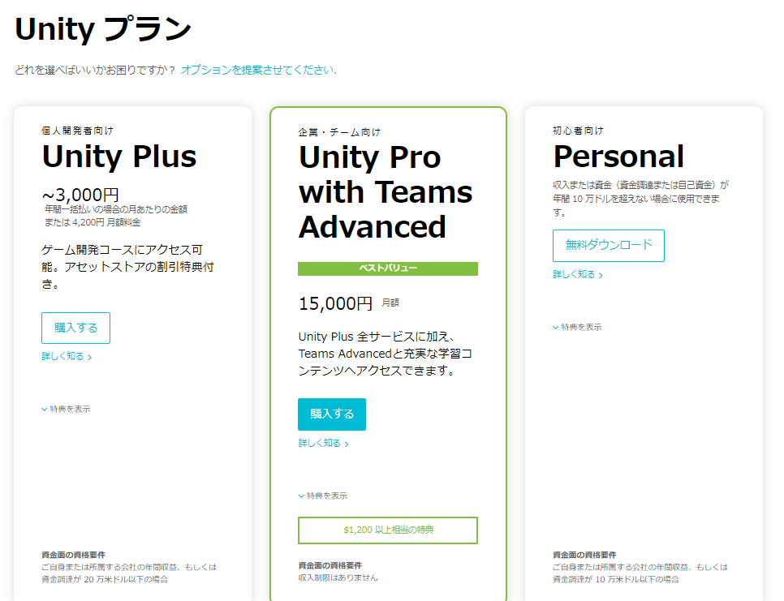

# タイピングゲームを作ってみよう
## Unityでのタイピングゲーム開発
---
### Unityとは

[Unity公式サイト](https://unity3d.com/jp)

- Unityがあれば様々なゲーム機に対応したゲームが作れる
  - iPhone
  - Android
  - PS4
  - PS Vita
  - WEB
  - Xbox
  - Facebook
  - ...

- Unityで作られた有名ゲーム
  - スーパーマリオラン
  - ポケモンGO
  - いっしょにチョキッとスニッパーズ
  - ...

- 無料から使える

---
### Unityをダウンロードしよう

#### ダウンロードサイトにアクセスする
ダウンロードサイト　
[https://store.unity.com/ja](https://store.unity.com/ja)

#### 初心者向け Personal を選ぶ
一番右側の **Personal** から **無料ダウンロード** をクリックする

---

## 早速つくってみよう

---

### 早速作ってみよう①

#### **アセット** を[ここから]()ダウンロードする

  - アセットとはゲームの部品のこと
  - 今回は専用アセットを使ってタイピングゲームを開発していきます
  - Unityにはたくさんの人が無料からアセットを提供する[アセットストア](https://www.assetstore.unity3d.com/jp/)があります

---

### 早速作ってみよう②

#### unityを起動する
以下の方法で起動できます
  - デスクトップのショートカットをダブルクリックする
  

#### Unityにアセットをインポートする

---

### Projectウィンドウとアセット

---

### `_MyScene` > `MySceneTest`
シーンとは

---

### PlayMode
プレイモードとエディットモード

---
### NewScene
自分のシーンを作る
---

### Prefab

prefabとは
インスタンスにする
---
### その他の設定
1. 1
1. 2
1. 3
1. 4

---
### Playする

---

### 問題文を変えるには
### プレーヤーの設定
### エネミーの設定
### スクリプトを触ってみる
