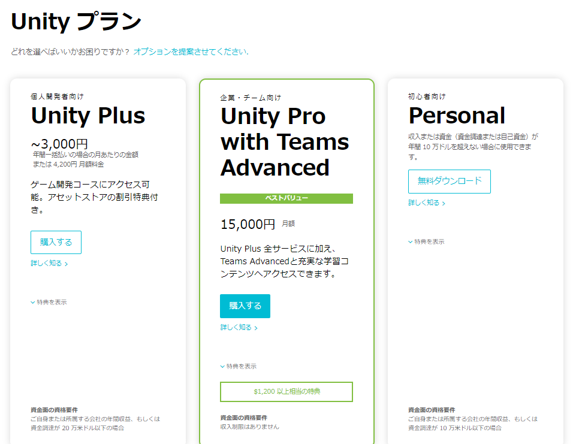
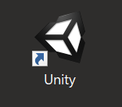
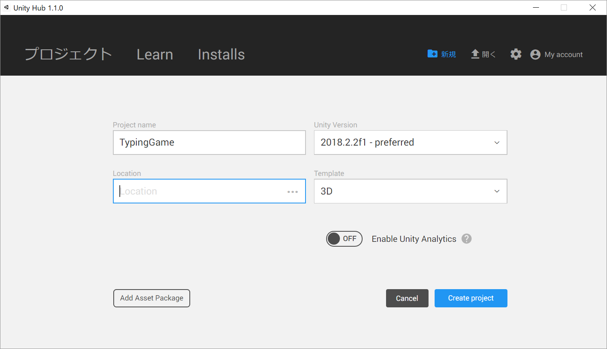
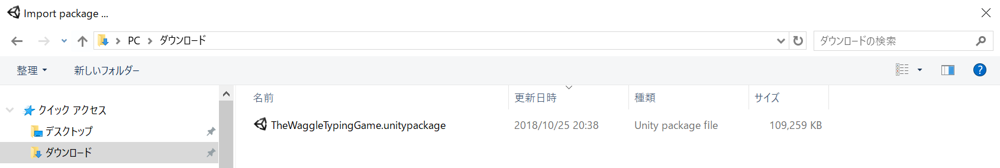
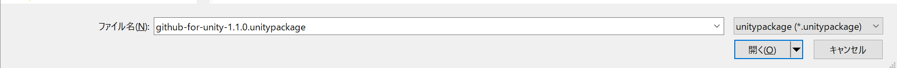
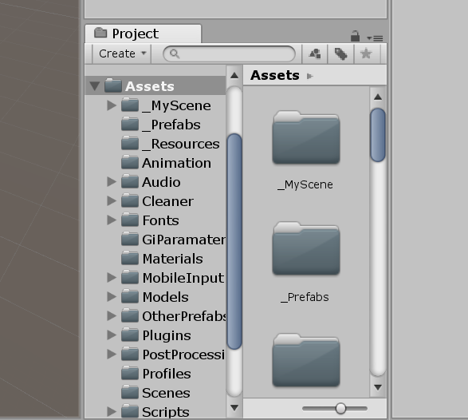

# タイピングゲームを作ってみよう
## Unityでのタイピングゲーム開発
---
### Unityとは

[Unity公式サイト](https://unity3d.com/jp)

- Unityがあれば様々なゲーム機に対応したゲームが作れます
  - iPhone
  - Android
  - PS4
  - PS Vita
  - WEB
  - Xbox
  - Facebook
  - ...

- Unityで作られた有名ゲーム
  - スーパーマリオラン
  - ポケモンGO
  - いっしょにチョキッとスニッパーズ
  - ...

- Unityは無料から使えます

---
### Unityをダウンロードしよう

#### ダウンロードサイトにアクセスする
ダウンロードサイト　
[https://store.unity.com/ja](https://store.unity.com/ja)

#### 初心者向け Personal を選ぶ
一番右側の **Personal** から **無料ダウンロード** をクリックする

---

## 早速つくってみよう

---

### **アセット** をダウンロードする

#### アセットとは

  - アセットとはゲームの部品のこと
  - Unityにはたくさんの人が無料からアセットを提供する[アセットストア](https://www.assetstore.unity3d.com/jp/)があります
  - 今回は専用アセットを使ってタイピングゲームを開発していきます

#### 専用アセットをダウンロードする

[こちらのページ](https://github.com/yuki-thewaggle/EduvationSummit2018/blob/master/TheWaggleTypingGame.unitypackage)にアクセスすると以下の画面が出ます

  

中央の右寄りにある **Download** ボタンを押してダウンロードしてください

---

### unityを起動する

デスクトップのショートカットをダブルクリックして起動してください

  

---

### 新規プロジェクトを作成する

新規プロジェクトを作成します

1. `Project name` を **TypingGame** にします
1. `Location` を **自分がフォルダを保存したい場所** にします
1. 他の項目はデフォルトのままで大丈夫です

以上3点が設定出来たら **Create project** ボタンをクリックしてプロジェクトを作成してください

---

### Unityエディタのレイアウトを設定する

このチュートリアルで採用する **Tall** レイアウトに変更します

**Window** > **Layouts** > **Tall** を選択してください

このようになります

---

#### Unityにアセットをインポートする

先ほどダウンロードした専用アセットをインポートします

**TheWaggleTypingGame.unitypackage** を選択して

**開く** ボタンをクリックしてください

インポートするファイルの選択画面が出てきます

デフォルトの状態で **Import** ボタンをクリックしてください

---

### Projectウィンドウからアセットを使う

インポートしたアセット（ゲームの部品）を利用してゲームを作成していきます

#### Projectウィンドウにアセットがインポートされたことを確認する

`Project`ウィンドウの `Assets` の中に画像のようなファイルが展開されていることを確認してください

---

### シーンを作る

自分のシーンを作ります

**File** > **New Scene** をクリックして新規シーンを作成してください

次に **File** > **Save Scene** をクリックしてシーンを保存してください

ファイル名に **Main** と入力して **保存** ボタンをクリックしてください

このように **Main** と表示されれば保存成功です

---

### Prefab

#### prefabとは

#### インスタンスにする

Projectウィンドウにあるアセットを実際の部品として生成します

**Assets** > **_Prefabs** にある 以下のものをすべて **Hierarchy** にドラッグ&ドロップしてください

- BackgroundMusic
- Floor
- GameManager
- HUDCanvas
- MainCamera
- MiniMapCamera
- Player

---
### その他の設定

- **Edit** > **ProjectSettings** > **Input** をクリック
  - **Axis**  > **Vertical** > **Horizontal** から **a** キー, **d** キーを消す
  - **Axis**  > **Vertical** > **Vercal** から **s** キー, **w** キーを消す

- **Window** > **Rendering** > **Lighting Settings** の **Skybox Material** を
**Assets** > **NightmaresProceduralSkybox** にする

- **Window** > **AI** > **Navigation**

  - NavMeshWalkableFloorのBakeをする(NavigationウィンドウでそのままBakeボタンを押すだけ)

- シーンを新規作成したときに自動生成されるMainCameraとDirectionalLightを削除

---
#### Playする

Maximize On PlayをONにする
動きを確かめる
(`_MyScene` > `MySceneTest`と同じだったらOK)

---

#### 問題なければ最後に

LightsとEnvironmentをインスタンス化する

---

### 問題文を変えるには
### プレーヤーの設定
### エネミーの設定
### スクリプトを触ってみる
